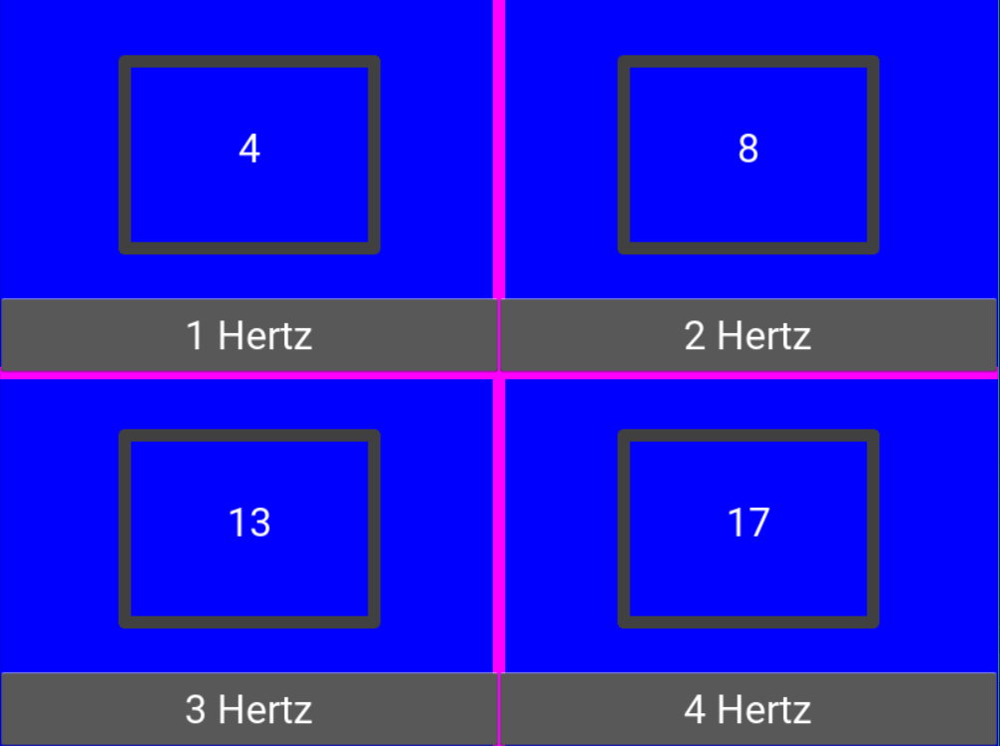
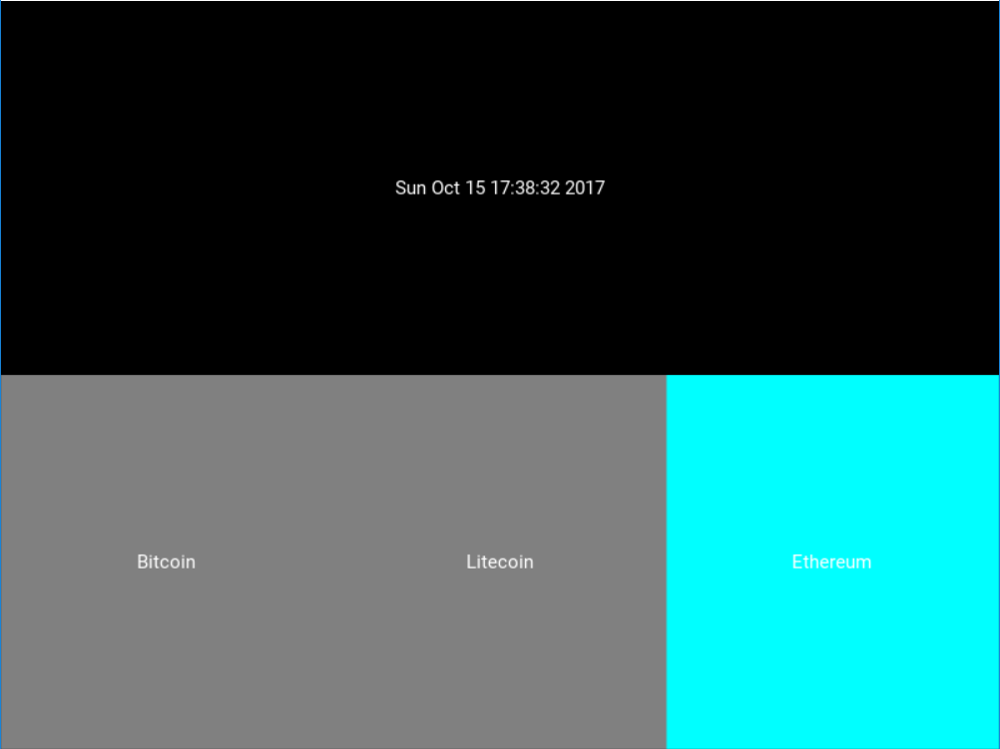
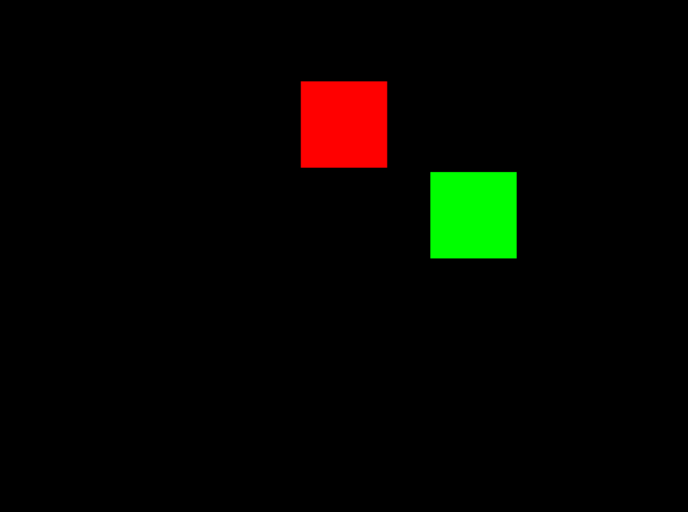
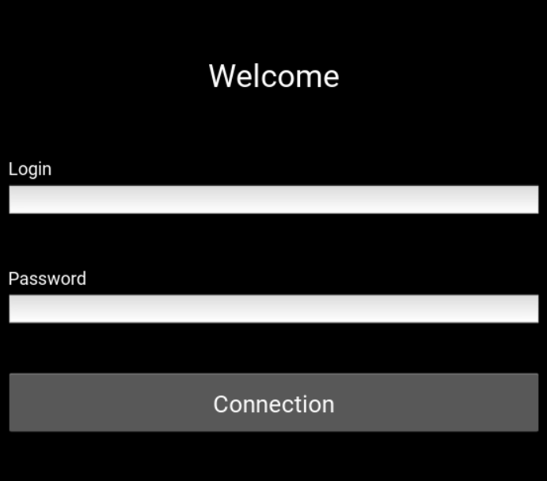
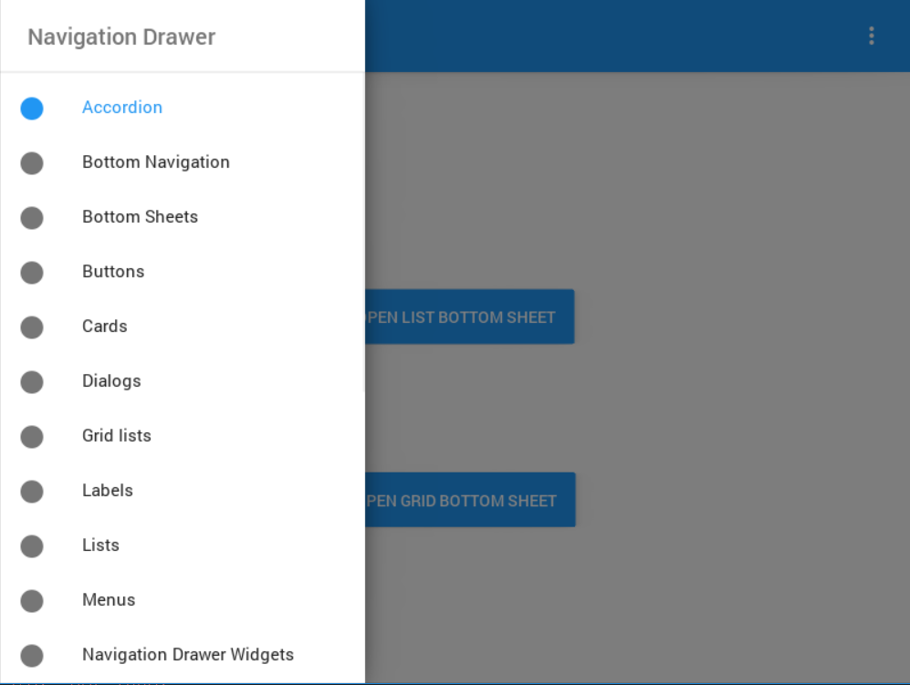

# Welcome to Kivy

This repository is meant to be a location to store code snippets for reference when needing to see simple examples of Kivy applications.  These have either been pulled off StackOverflow, Kivy documentation, altered examples from SO, coded myself, or all of the above.  This is intended to be educational as these helped me play with and understand the Kivy environment and add functionality to apps.

## Clock

Demonstration of displaying a clock in kivy.

### clock_display_updates.py

Show multiple clocks tracking at different times and updating the UI based on the different tracking and reset buttons.

### clock_multiple_schedules.py

Another example of multiple times updating label backgrounds based on the interval that the section gets updated.

### clock_queue.py

An example of putting clocks in a queue, reading from it and updating the UI.

### clock_refresh_button.py

A slightly altered version of the simple clock by updating the time via a button push instead of on a timer.

### clock_simple.py

As the title states the simplest clock function you can make by utilizing the system time and update window functionality.

### clock_track_movement.py

An example that moves objects around the screen based on vector speed and previous location to update the UI based on the settings of the Clock refresh.

## Display

Many examples of placing widgets, managing screen, and integrating recycle viewer into a Kivy screen.

## Login

### login.py and connected.py

An example of a simple login and screen wipe to a new screen confirming the move.

## Material Design

This is a package that makes it easy to handle GUI for Kivy.  It much be cloned from GitLab as the GitHub repo has been deprecated.

https://gitlab.com/kivymd/KivyMD

### kivymd_hello_drawer.py

The default example based on KivyMD

